import './dark.less'

## Problem

Some specifications—such as the [federation specification](../federation-spec) and [CSDL specification](./csdl)—apply to GraphQL schema documents. They may place additional requirements on conforming documents. Such specifications may also introduce new types, directives, and other schema objects which can be used within those documents.

The [GraphQL Schema Definition Language](https://spec.graphql.org/) does not provide a way to declare that a schema document implements additional specs beyond the GraphQL SDL. Currently, this information is derived from context, or through some explicit, out-of-document paramenter provided to a spec processor. As a consequence, given only the text of an SDL document, there is no reliable way to discern what specifications—and what version of those specifications—the document conforms to.

This specification provides a solution in the form of a single new well-known directive—the `@using` directive. This directive allows spec authors, schema authors, and schema processors to come to an agreement on which specifications a schema document is using.

## Actors

```mermaid
graph TB
  author("👩🏽‍💻 🤖  &nbsp;Author")-->schema(["📄  Schema"])
  schema-->proc("🤖 &nbsp;Processor")
  schema-->reader("👩🏽‍💻  Reader")
  proc-->output(["📄  Output Schema"])
```



- **Authors (either human or machine)** write one or more `@using` directives into schema files to declare that the schema conforms to some set of specifications
- **Machine processors** read the `@using` directives and compare them to a list of supported schema specs, activating the spec-mandated appropriate behaviors
- **Human readers** see the `@using` directives and can follow the URLs to the specification, receiving an explanation of the requirements of the specification and what new directives, types, and other schema objects are available within the document.

## The `@using` directive

### `@using` within a document

<code class='grammar'>
directive @using(spec: use_URL!)
  repeatable on SCHEMA
</code>

The `@using` directive is applied to `schema` declarations to declare that the schema uses a particular spec. For example,

<a name='ex-using-use' href='#ex-using-use' class='listing'>Using the <code>@using</code> directive</a>

```graphql
schema @using(spec: "https://spec.example.com/exampleSpec/1") {
  query: Query
}
```

### Requiring `@using` within a spec

Specifications **may** include the following language to instruct schema authors to use `@using` to indicate documents which are intended to conform to the specification:

> SPEC_NAME schema documents **must**/**should**/**may** have a `schema` declaration with a [`@using` directive](/specs/use)
> and the specification URL `SPEC_URL`:
>
> ```graphql
> schema @using(spec: SPEC_URL) {
>   query: Query
> }
> ```

`SPEC_NAME` and `SPEC_URL` should be replaced with the names and URLs for the specification. For example:

> Example Spec schema documents **must** have a `schema` declaration with a [`@using` directive](/specs/use)
> and the specification URL `https://specs.example.com/exampleSpec/1`:
>
> ```graphql
> schema @using(spec: "https://specs.example.com/exampleSpec/1") {
>   query: Query
> }
> ```

## Processing Schemas

```mermaid
graph LR
  schema(["📄  Input Schema"]):::file-->proc("🤖 &nbsp;Processor")
  proc-->output(["📄  Output Schema"]):::file
  classDef file fill:none,color:#eee;
  style proc fill:none,stroke:fuchsia,color:fuchsia;
```



A common case is that of a processor which consumes an input schema and generates an output schema.

The general guidance for processor behavior is: don't react to what you don't understand.

Specifically, processors:
  - **should** pass through `@using` directives which reference unknown spec URLs
  - **should** pass through unknown directives, types, and other schema elements
  - **should** ignore meaningless URL components (such as unknown query parameters or fragments) within `@using` URLs

An exception to this is processors which prepare the schema for final public consumption. Such processors **may** choose to eliminate all unknown directives and prefixed types in order to hide schema implementation details within the published schema. This will impair the operation of tooling which relies on these directives—such tools will not be able to run on the output schema, so the benefits and costs of this kind of information hiding should be weighed carefully on a case-by-case basis.

## Spec URLs

<code class='grammar'>
  scalar using_URL
    @specifiedBy(url: "https://apollographql.com/docs/specs/using#spec-urls");
</code>

The URL of a specification.

Specification URLs **must** be valid [RFC1738 URLs](https://tools.ietf.org/html/rfc1738). They **should** provide the content of the appropriate version of the specification in some human-readable form. It is not required that the content be machine-readable in any particular way.

The final component of the URL's `"/"`-separated `<path>` **must** be a valid [SemVer specifier](#semver-specifiers) identifying the version of the spec in use. Everything prior to the version specifier is the spec's *base URL*. Processors **should** treat the spec's base URL as an opaque string identifying the specification.

This spec assigns no meaning to additional URL components, such as the query string or fragment. Processors **should** ignore any meaningless URL components when parsing the base URL and semver specifier.

<a name='ex-using-querystring' href='#ex-using-querystring'><code>@using</code> directive</a>

```
schema @using(spec: "https://spec.example.com/exampleSpec/1?unrelated=value")
```

This directive:
- Declares that the document conforms to a spec which can be found at `https://spec.example.com/exampleSpec/1`
- Has a base URL of `https://spec.example.com/exampleSpec`
- Has a [semver specifier](#semver-specifier) of `1`
- Has a query string of `"unrelated=value":
  - This has no effect unless `exampleSpec` assigns it specific meaning.

## Semantic Versioning

Specifications **should** provide a semantic version number.

### SemVer Specifiers

The final `/`-separated path component **must** be a semver specifier. Semver specifiers take the form *major*.*minor*.*patch*-*prerelease*. The minor, patch, and pre-release specifiers are all optional. Examples:

```
1
1.2
1.2.3-alpha
2.2.3-alpha.2
```

### SemVer selection

Processors **should** select the highest available spec implementation which is compatible with the requested version according to the [SemVer 2.0.0](https://semver.org/spec/v2.0.0.html) rules for version compatibility. For example, consider this directive:

<a name='ex-using-version-2' href='#ex-using-version-2'><code>@using</code> version 2.x.y</a>

```graphql
schema @using(spec: "https://specs.example.com/exampleSpec/2")
```

Upon seeing this directive, processors which support the `https://specs.example.com/exampleSpec` spec **should** activate a version of their implementation which is compatible with major version 2.

<a name='ex-using-version-311a' href='#ex-using-version-311a'><code>@using</code> version 3.1.1-alpha</a>

```graphql
schema @using(spec: "https://specs.example.com/exampleSpec/3.1.1-alpha")
```

This selects versions in the `3.1.1-alpha` prerelease series. For example, a processor may satisfy this requirement by activating version `3.1.1-alpha.2` of `exampleSpec`.

### Why is versioning in the URL, not a directive argument?

The version is in the URL because when a human reader visits the URL, we would like them to be taken to the documentation for the *version of the specification in use by this document*. Putting the version information in a separate argument to the `@using` directive would prevent this.

### Backus-Naur Form for SemVer specifier

```
<valid specifier> ::= "v" <partial semver>
<partial semver> ::= <major>
                   | <major> "." <minor>
                   | <major> "." <minor> "." <patch>
                   | <major> "." <minor> "." <patch> "-" <pre-release>
```

`<major>`, `<minor>`, `<patch>` and `<pre-release>` are defined in [the Semantic Versinoing 2.0.0 spec](https://semver.org/spec/v2.0.0.html).
