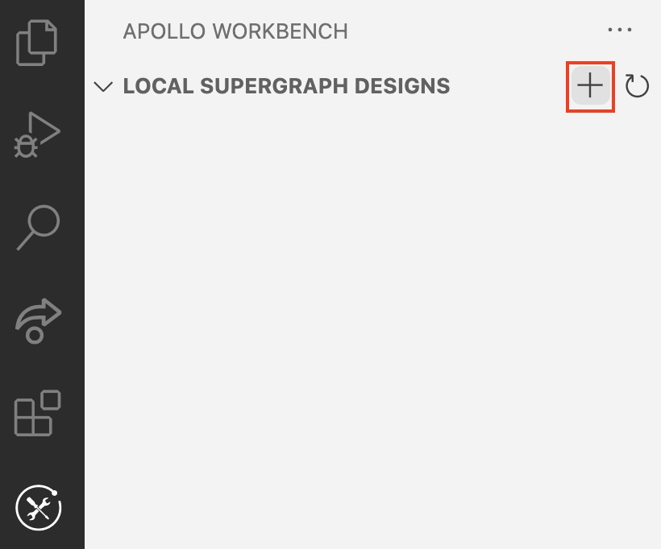
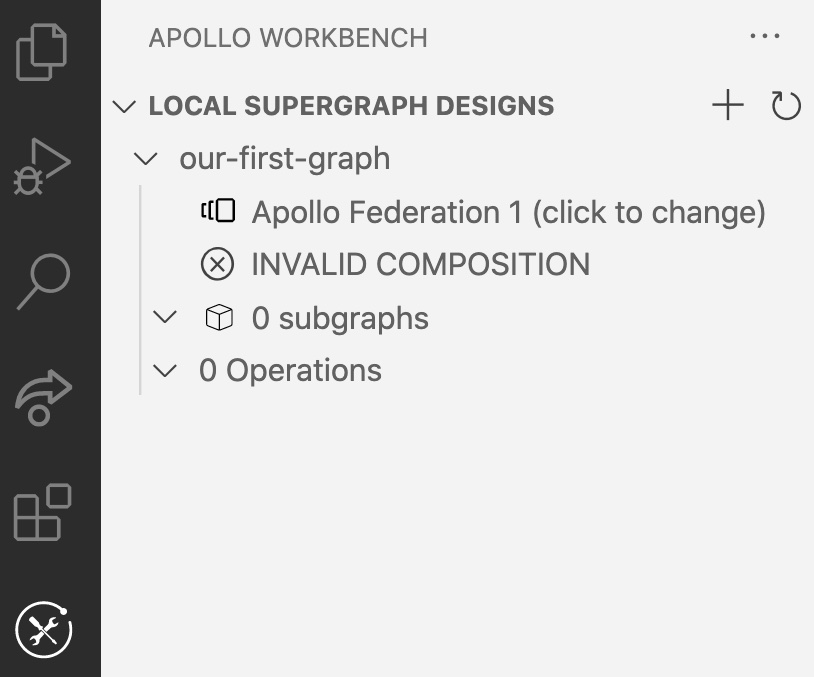
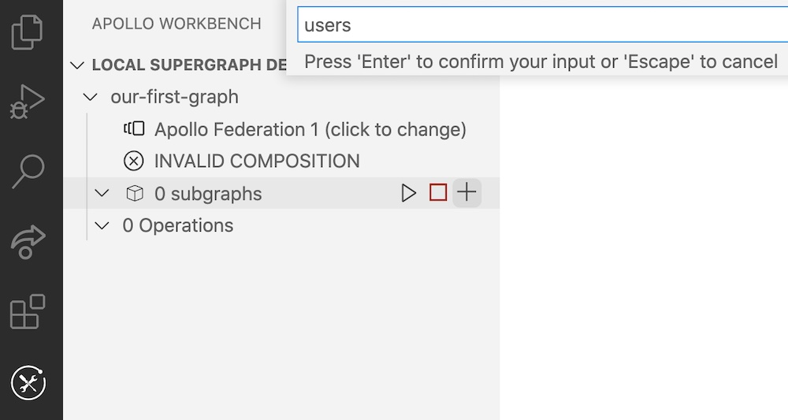
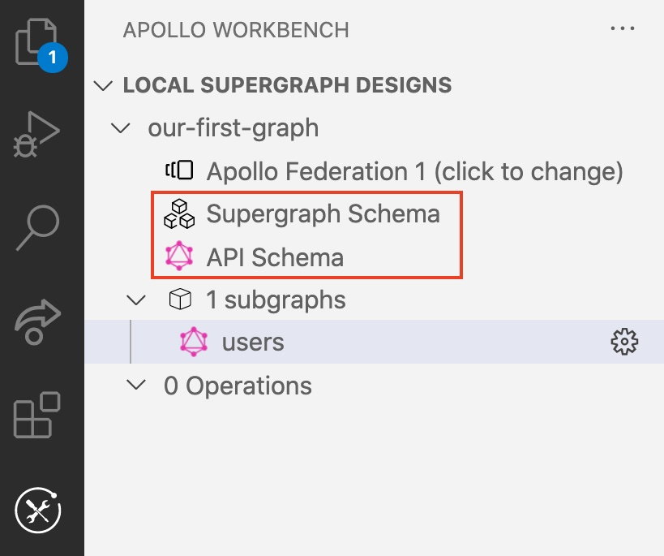
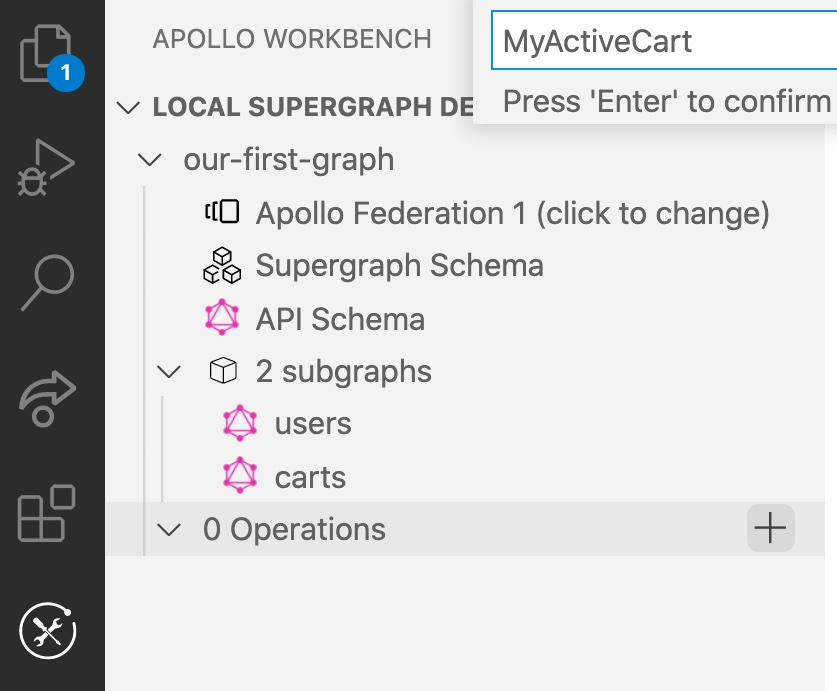
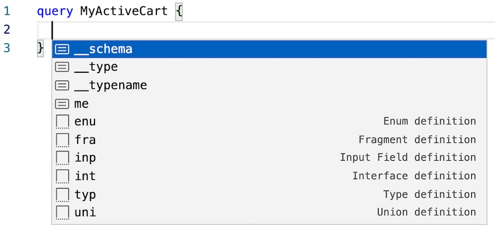
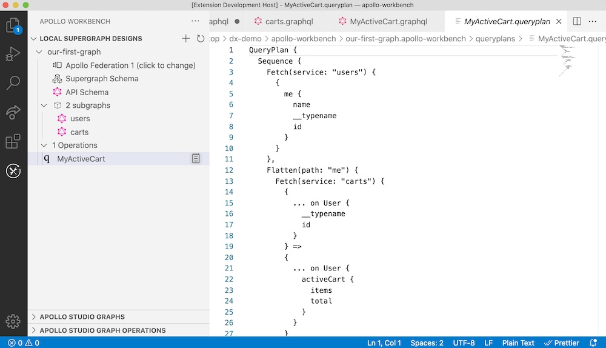

This article helps you create a new federated graph design from scratch in Apollo Workbench.

> If you have an existing graph in Apollo Studio that you want to bring into Workbench, see [Importing a Studio graph into Workbench](./import-studio-graph/).

## Create your first design

After you've [set up Workbench](./setup/) and opened VS Code to a folder of your choice, select Workbench from the Activity Bar and then click the **+** button next to **Local Graph Designs**:



After you provide a name for your graph, Workbench creates a `.apollo-workbench` file in the opened folder. This new **design** is shown in the navigation panel:



## Add your first subgraph

You're ready to add a subgraph to your design. Click the **+** button next to **subgraphs** and provide a name for your subgraph:



Next, you need to define your subgraph's schema. Click the newly created subgraph in the navigation panel to open its schema file. Paste in the following schema and save the file:

```graphql:title=Users
type User @key(fields:"id"){
  id: ID!
  name: String
  email: String
}

type Query {
  me: User
}
```

As you edit your subgraph schemas, Workbench constantly runs composition to validate them. Whenever you _save_ a schema, Workbench commits that composition run as the design's new supergraph schema (assuming composition succeeds).

At this point, you have a composed supergraph, and both its [supergraph schema](../federated-types/overview/#supergraph-schema) and [API schema](../federated-types/overview/#api-schema) are shown in the navigation panel. You can click either item to view it (these files are read-only).



## Add a second subgraph

Let's add another subgraph to take full advantage of Apollo Federation. Follow the [previous step](#add-your-first-subgraph), but this time name the subgraph `carts`.

Paste the following schema and save:

```graphql:title=Carts
type Cart @key(fields:"id"){
  id: ID!
  name: String
  email: String
}

type User @key(fields:"id") {
  id: ID!
  activeCart: Cart
}
```

Congratulations, you now have a federated graph design with multiple subgraphs!

## Write your first operation against the graph

Now that you have a federated graph design that composes successfully, you can try writing GraphQL operations against the design.

Create a new operation by clicking the **+** button next to **Operations** and providing a name in the input box:



While you're building your operation, Workbench can provide intelligent code completion based on your design (press `CTRL+Space`):



Paste the following into the operation editor and save it:

```graphql
query MyActiveCart {
  me {
    name
    activeCart {
      items
      total
    }
  }
}
```

## View your operation's query plan

Workbench can generate the query plan for any valid operation against your design.

To generate a query plan, click the document icon that appears when you hover over an operation in the navigation panel:



---

Now that you've created your first design:

* Learn how to [run it locally](./mocking/).
* Learn how to [export it](./exporting/).
