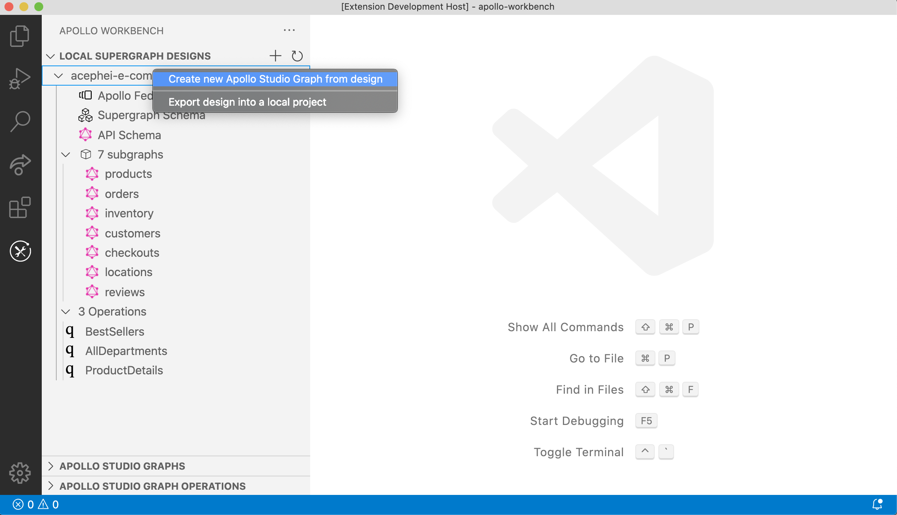
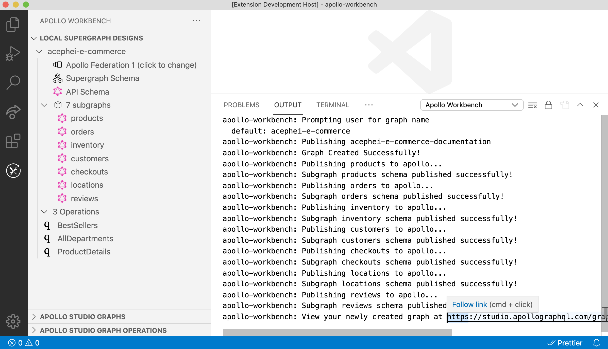

Apollo Workbench enables you to push a design into your Apollo Studio account as a new graph. This comes with an [exported project](./exporting/) that has Managed Federation set up by default.

You will be prompted to name your graph; this is the name for the graph that will be created in Apollo Studio. The graph name cannot previously exist. You will be prompted the same as an [exported project](./exporting/). Once complete, Apollo Studio should automatically open to the newly created graph. If you run the exported project locally, the graph router will be set up with Managed Federation

