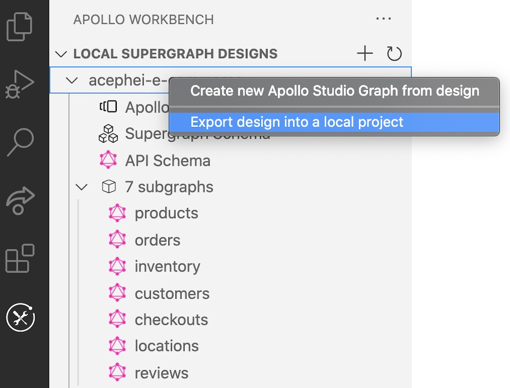
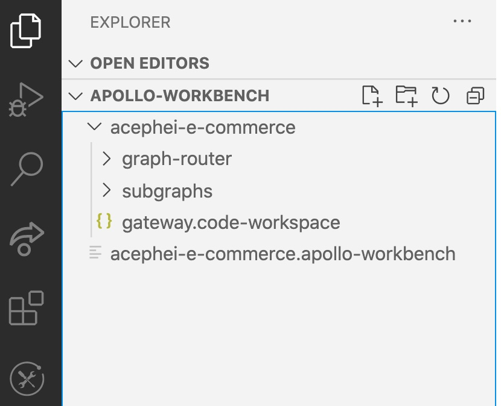
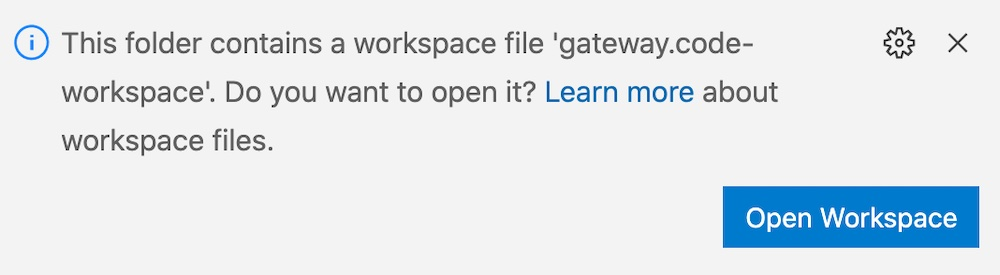
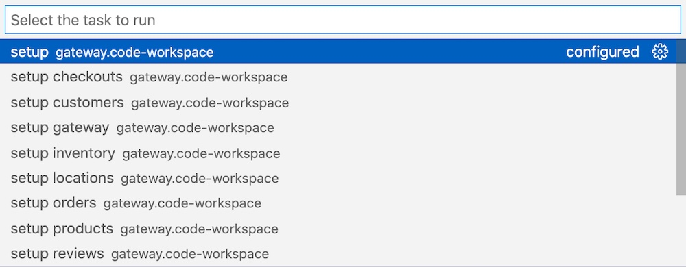
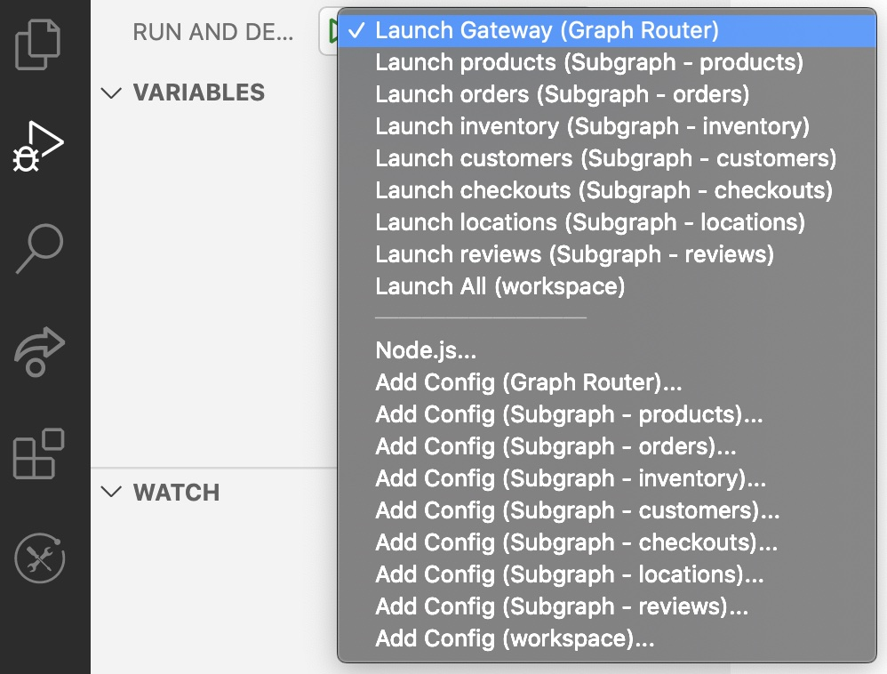
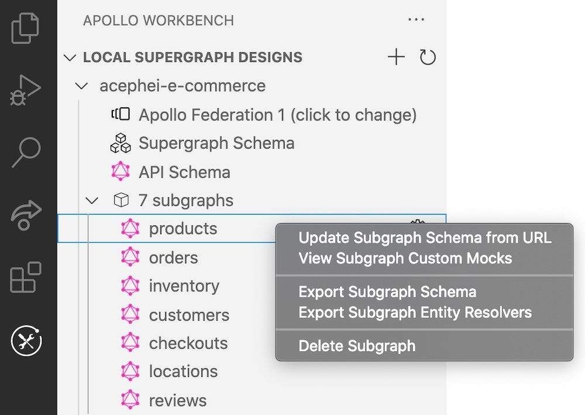

When you finish designing your federated graph in Workbench, you can export your work for use in your project.

Workbench enables you to export any of the following:

* An entire template project based on your design
* A single subgraph schema in your design
* [Entity resolvers](../entities/) for a single subgraph in your design

## Exporting a local template project

To export a template project from your Workbench design, right-click the design in the navigation panel and select **Export design into a local project**:

Workbench creates a template project with the following structure:

The project's top-level directory matches the name of the design you exported from.

The exported project contains:

* `graph-router`, a folder containing the source for your federated graph's gateway
* `subgraphs`, a folder containing a source subfolder for each subgraph
* A `.code-workspace` config file that helps you run the entire project locally

### Open the project's workspace

After you export your template project, open its `.code-workspace` file (VS Code should prompt you to do this automatically). Click the **Open Workspace** button that appears in the bottom-right corner of VS Code:

### Run the `setup` command

Opening the project's workspace enables you to run helpful tasks in the VS Code Command Palette (**View > Command Palette**). There's a separate setup task for each source folder in the project, along with a _compound_ setup task (named just `setup`):

The compound `setup` task runs `npm install` for each directory and then uses the Rover CLI to compose the supergraph schema for your gateway.

### Run and debug

After you set up the template project, you can try out debugging it. Open the Debug tab in VS Code to view launch and config commands for individual subgraphs, along with a **Launch All** option that runs your gateway and all subgraphs in debug mode:

## Exporting to Studio

> After you export a design to Studio, that Studio graph does _not_ automatically receive any updates you make in Workbench. Exporting is a one-time operation.

Documentation forthcoming.

## Exporting from individual subgraphs

You can export the following for an individual subgraph in your design:

* The subgraph's schema
* An example set of reference resolvers for all [entities](../entities/) defined in the subgraph schema

To do so, right-click any subgraph in your Workbench design and select the appropriate option (**Export Subgraph Schema** or **Export Subgraph Entity Resolvers**):

