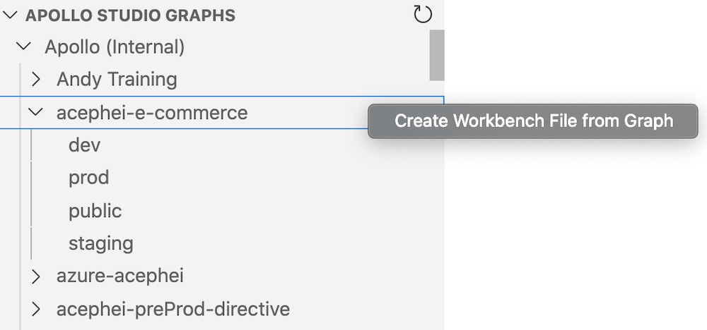
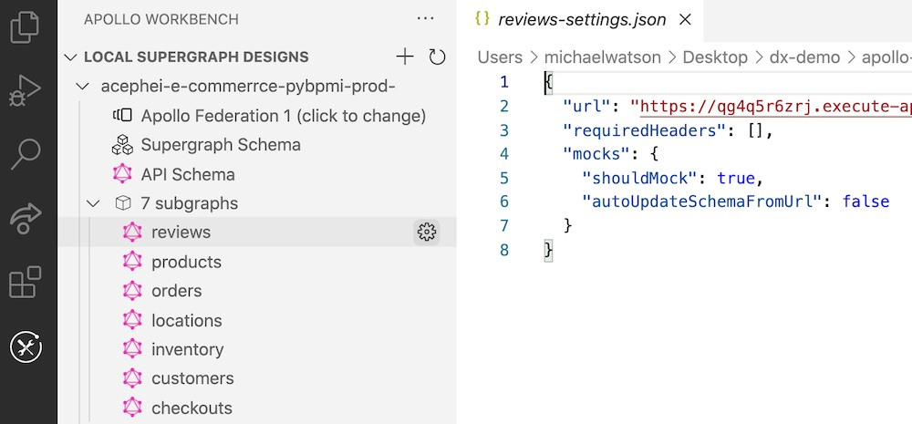

You can create a new graph design in Workbench by importing the schemas of an _existing_ graph in Apollo Studio.

After you [authenticate Workbench with Studio](./setup#authenticating-with-apollo-studio), the navigation panel displays all of the Studio graphs you have access to. Right-click the graph you want to start from and select **Create Workbench File From Graph**:



If the graph you select has multiple variants, Workbench prompts you to specify one.

Workbench creates a read replica of the Studio graph for you to edit locally. The replica includes the `url` for each subgraph, which you can use while [testing parts of your design locally](./mocking/).



## Importing operations

In addition to importing an entire Studio graph, you can import individual _operations_ that have been executed against a graph.

After you select a Studio graph in the Workbench navigation panel, the **Apollo Studio Graph Operations** section displays operations that have been executed against that graph in the last 30 days (you can [configure this time frame](#configuring-the-operation-time-frame)):


You can click an operation to preview it, or click the **+** button to add that operation to your local design.

### Configuring the operation time frame

By default, Workbench displays operations that were executed against your graph in the last 30 days. You can configure this time frame with the `apollo-workbench.daysOfOperationsToFetch` extension setting:

```json
"apollo-workbench.daysOfOperationsToFetch": 60
```

---

Now that you've imported a Studio graph:

* Learn how to [run it locally](./mocking/).
* Learn how to [export it](./exporting/).
