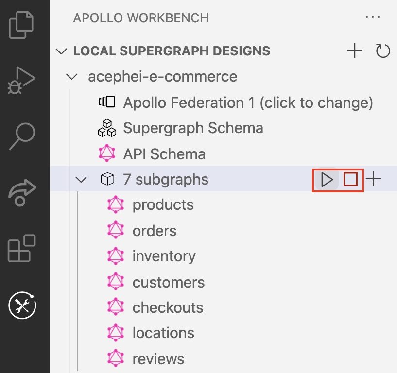
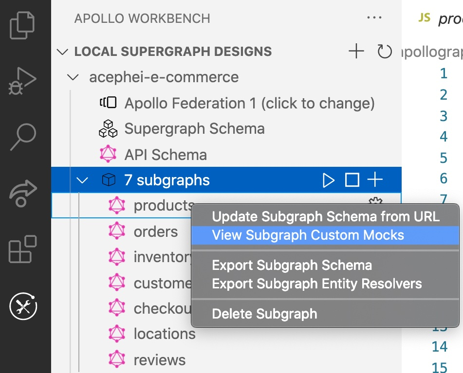
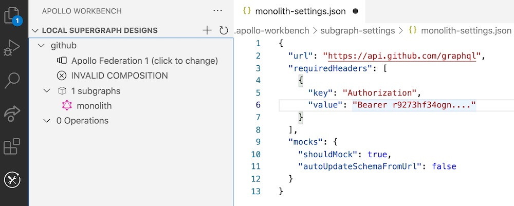

Apollo Workbench enables you to run a mocked version of any fully composing supergraph design on your local machine.

## Starting and stopping

To start your mocked supergraph locally, click the triangular Play button that appears when hovering over the subgraphs row in the navigation panel:



To stop execution, click the square Stop button.

By default, the mocked supergraph gateway runs on port `4000`. Subgraph ports start with `4001` and increment by one (`4002`, etc.).

You can override these defaults by modifying your VS Code user settings (go to **Extensions > Apollo-Workbench** and click **Edit in settings.json**):


```json
{
  "apollo-workbench.gatewayPort": 4000,
  "apollo-workbench.startingServerPort": 4001
}
```

> You can only run one supergraph design at a time. Whenever you start a design, any other running design is stopped.

## Defining custom mocks

You can define custom mocks for any subgraph in [the same format Apollo Server expects for mocks](https://www.apollographql.com/docs/apollo-server/testing/mocking/). Access the custom mocks for any subgraph by right-clicking the subgraph name and selecting **View Subgraph Custom Mocks**:



> Custom mocks are stored as raw strings in the `apollo-workbench` file and synced whenever changes are saved to the actual `.js` file. Valid JavaScript or TypeScript is required for an exported `mocks`.

### How do mocks work in Workbench?

When you run your design, Workbench starts one Apollo Server instance for each mocked subgraph in the design. Each instance dynamically creates reference resolvers for any entities that the subgraph defines. These resolvers are used in combination with any defined custom mocks to resolve incoming operations.

Workbench also starts a separate Apollo Server instance to act as the gateway, using the `@apollo/gateway` library. This instance is passed the supergraph schema composed from your subgraph schemas.

When all server instances have started, Workbench opens Apollo Sandbox so you can execute operations against the gateway.

## Using non-mocked subgraphs

You can choose to mock _some_ of your subgraphs while the _rest_ of your subgraphs use actual GraphQL endpoint URLs. These URLs can be local or remote (such as the URL of a staging subgraph).

To specify a URL for a non-mocked subgraph, first open that subgraph's settings in Workbench:


Then do all of the following:

1. Add a `url` option that specifies the subgraph's URL.
2. Set the `mocks.shouldMock` option to `false`.
3. Save your changes.

> Workbench does not verify whether a subgraph's remote `url` is reachable.

### Sending custom headers

Whenever Workbench communicates with a GraphQL endpoint (such as one of your staging subgraphs), it might need to provide custom HTTP headers that the endpoint requires.

You can provide these headers in a subgraph's settings via the `requiredHeaders` option:



### Syncing a subgraph's schema

Whenever you're running a Workbench design with non-mocked subgraphs, the schemas for those subgraphs might change at any time (for example, if a new subgraph version is deployed to staging).

To account for these changes, Workbench can sync your design's version of a subgraph's schema with the version at its `url`.

To enable syncing, set the `mocks.autoUpdateSchemaFromUrl` option to `true` in your subgraph's settings (this option is shown above in [Using non-mocked subgraphs](#using-non-mocked-subgraphs)).

As long as syncing is enabled, Workbench regularly pings the subgraph's `url` for schema updates while your design is running. Any schema updates are saved to the subgraph schema in the `.apollo-workbench` file.
