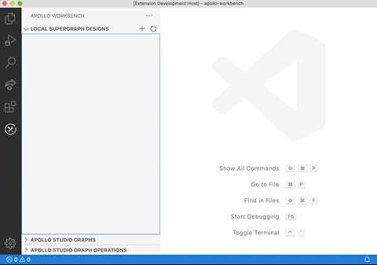
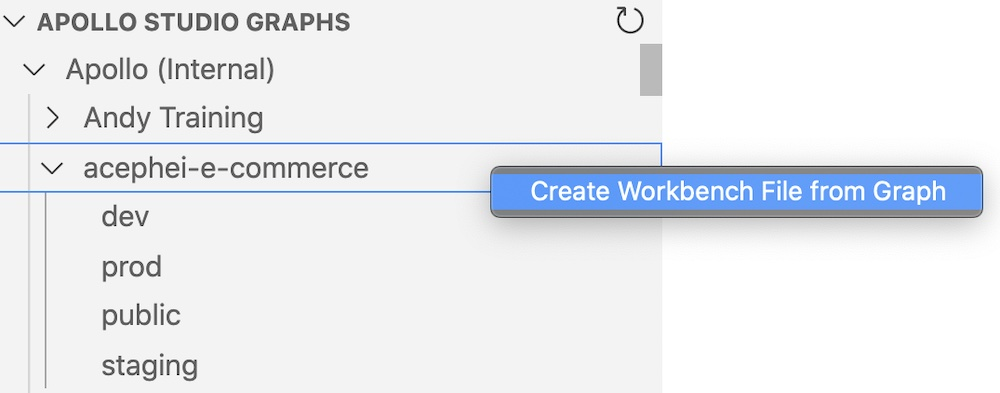
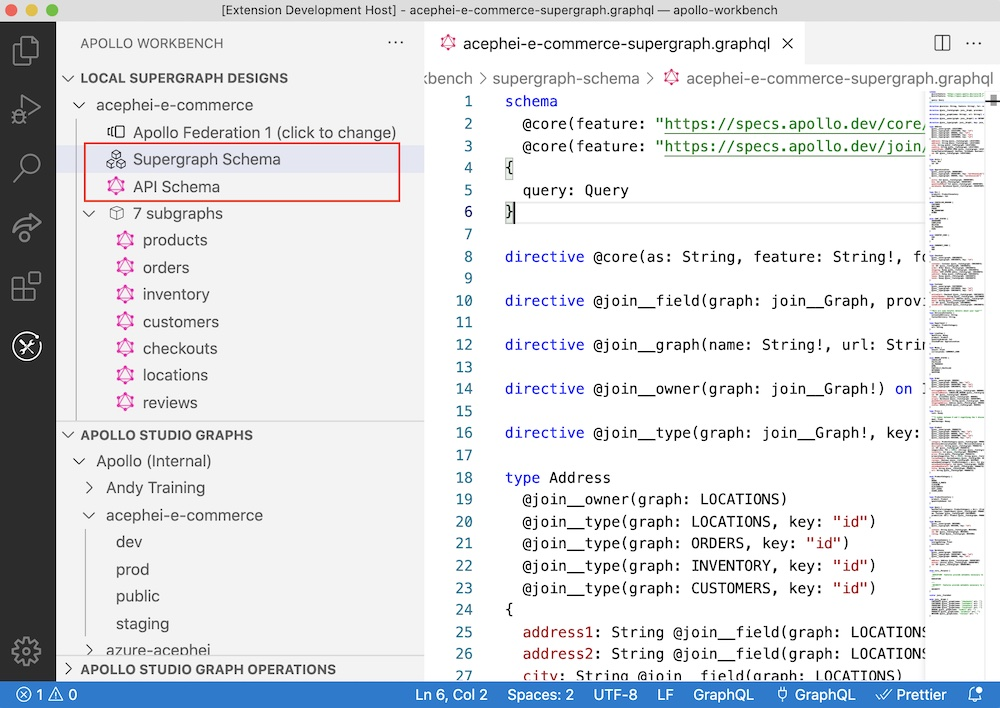
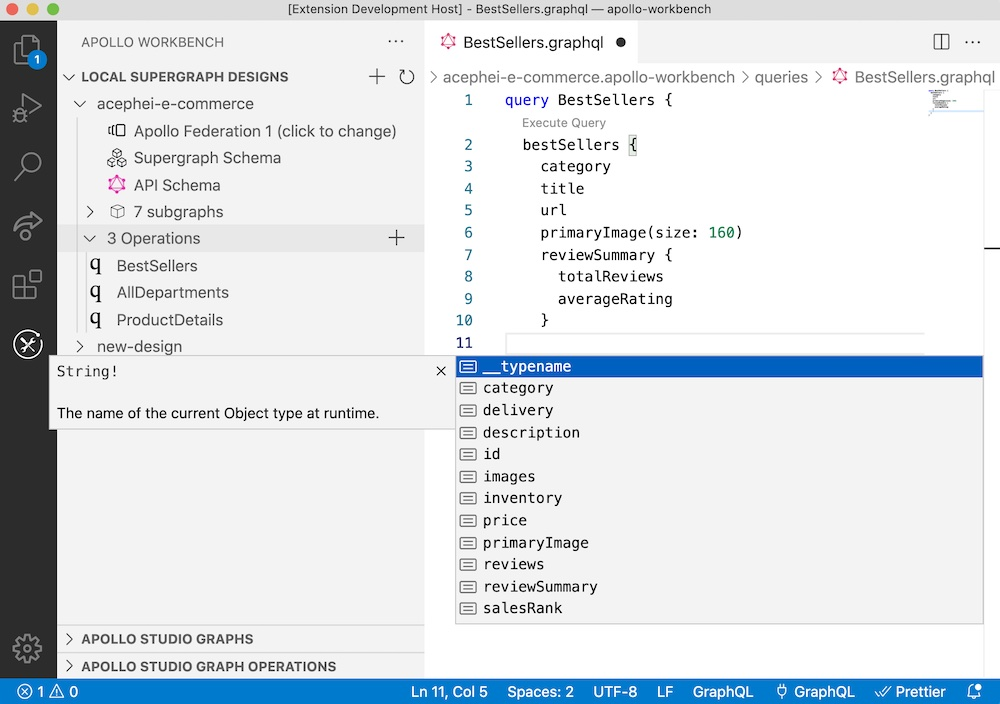
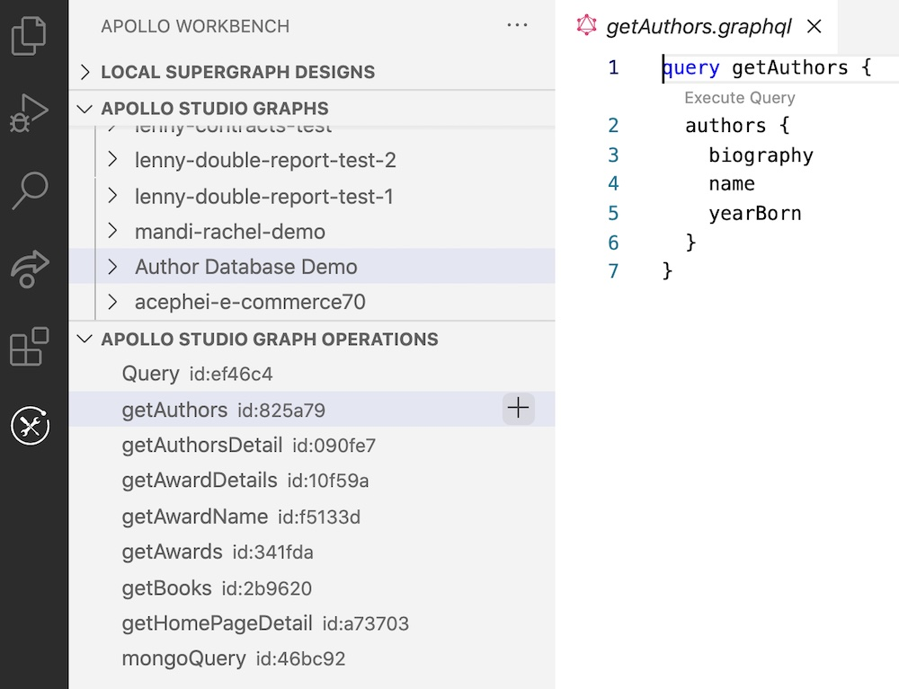
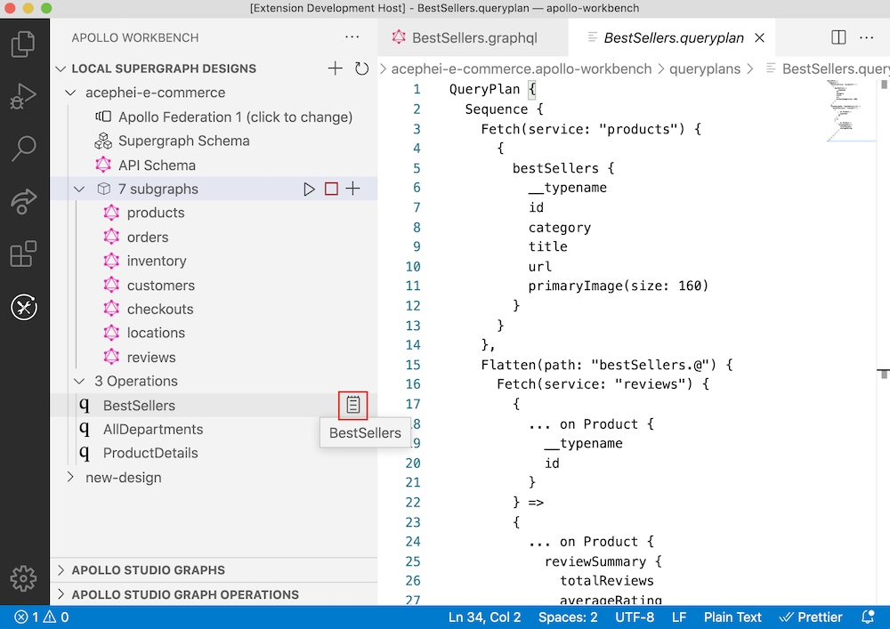
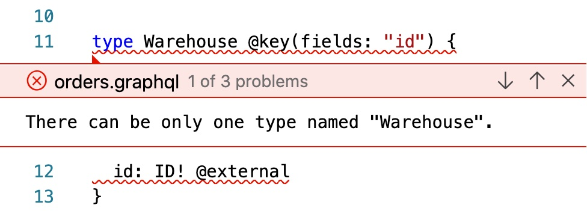

import { Link } from 'gatsby';

**Apollo Workbench** is a [VS Code extension](https://marketplace.visualstudio.com/items?itemName=apollographql.apollo-workbench) that helps you design and reason about your organization's graph without writing any server code.

Currently, Workbench is especially useful for working on _federated_ graphs. Whether you're creating a new graph or making changes to an existing one, Workbench helps you understand how your graph composes throughout the design process.

  <ButtonLink
    colorScheme="indigo"
    to="./setup/"
  >
    Get started
  </ButtonLink>

## Create graphs

### Build graphs from scratch

Quickly create a new design and start adding subgraphs:

### Import graphs from Studio

After [authenticating Workbench with Apollo Studio](./setup/#authenticating-with-apollo-studio), you can create local Workbench designs that are based on any Studio graph you have access to:

See [Importing a Studio graph into Workbench](./import-studio-graph).

### View supergraph and API schemas

As soon as you have a design that successfully composes, you can view its supergraph and API schemas:

These schemas update as you make changes to your subgraph schemas.

## Create operations

### Build operations from scratch

Workbench provides intelligent code completion to help you write operations against your design:

### Import operations from Studio

After [authenticating Workbench with Apollo Studio](./setup/#authenticating-with-apollo-studio), you can import operations that have been executed against any graph you have access to:

See [Importing operations](./import-studio-graph/#importing-operations).

### View query plans

You can view the query plan that the gateway uses to route each GraphQL operation based on your subgraph schemas:

> Your design must compose successfully to be able to view query plan details.

## Debug your graph

### See composition errors in-line

Any composition errors in your design are displayed in both the VS Code editor and the Problems panel. This helps you understand conflicts and resolve them before writing any server code for your subgraphs:

### Run locally with mocks

See [Testing designs locally](./mocking/).

## Export your designs

See [Exporting Workbench designs](./exporting/).

Ready to try it out? Continue to [Setup](./setup/).
