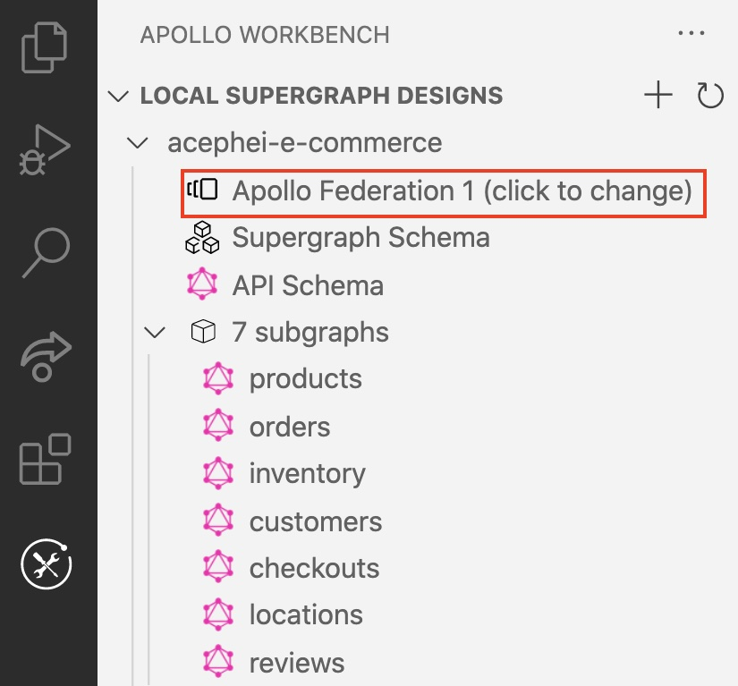
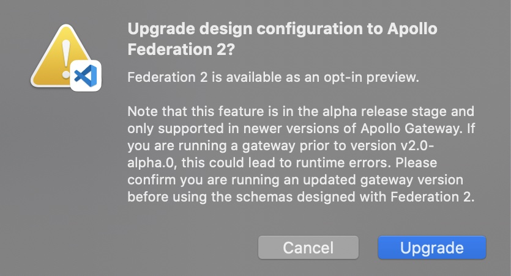

Workbench enables you to use Federation 1 or Federation 2 composition with any design. By default, all designs use Federation 1 until the general availability of Federation 2.

Each design's Federation version is shown in the navigation panel:

To switch a design's Federation version, click the current version in the navigation panel. A confirmation dialog appears that describes the preview status of Federation 2:

After you switch versions, a notification appears in the bottom-right corner of VS Code:

You can now begin using [Federation 2 features](../federation-2/new-in-federation-2/) in your subgraph schemas.
