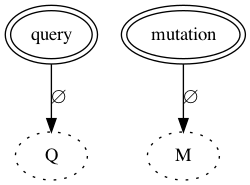
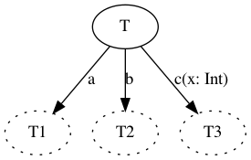
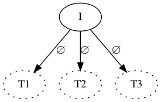
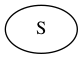
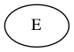

# Generalized Composition Model

This document proposes a generalized model of federation. That is, it describes how subgraphs are
composed together, when such composition is valid, and what is the semantic of that composition. In
other words, this document proposes a detailed definition of the composition process (one that is
more flexible than the existing one).

For the purpose of this definition, we decompose composition into 3 steps:
1. a merging step, that merges `n` subgraph schema into a (potentially invalid) supergraph. Note
   that this step can error out.
2. a validation step, that given the `n` subgraph and the merged supergraph, determines if that
   composition is valid or not.
3. a decoration step, where given the `n` subgraph and the merged supergraph, the supergraph is
   decorated with `join` spec directives.

_TODO_: we should actually merge step 3 with step 1. While those could theoretically be defined
somewhat separately, this is awkward because you need to know from which subgraph things come
from and muddies the water since that make the output of merge being some new kind of document.
Having merge directly generate the joins directive (thus transforming the federation ones) is easier.
And if we do make sure the supergraph is fully reversible, then we can also define the validation
step to be only on the merged supergraph (since subgraphs can be mechanically obtain from it). Do
note that make it so that a supergraph can be fully decomposed will require stuffs like marking
from which subgraphs each directive application comes from, which might require considering that
directive application order in supergraph is genuinely meaningful (which is not inconsistent with
the graphQL spec which explicitly states that "directive order significant").

_TODO_: we should handle the "raw" verification of federation directives. Things like ensuring a @key,
@requires or @provides only refers to columns that are actually defined. I believe this could be
done as a separate step before the merging one, one applied to each subgraph independently, since we
essentially want those definitions to be well defined within each subgraph.

_TODO_: also add that after merging, the supergraph schema needs some graphQL validation. For
instance, it's possible that when you merge an interface, some type that were implementing that
interface in a subgraph no longer implements the merged interface (basically, it doesn't have some
fields coming from other subgraphs). We should maybe defined those rules that need to be
re-validated, and in terms of implementation, we may want to special case those re-validation so as
to provides good errors (in the interface example, we'd want a message that talks about subgraphs).
Known invalid things that merging may create:
- object types that are marked as implementing an interface but not having all
  necessary fields.
- directives that are not repeatable but appears multiple times (with differing
  arguments).

## Prerequisites

This document assumes the existing of a number of mechanisms that are not fully fleshed at the time of this writing but
would have to be for this proposal. We will not describe those mechanisms in details in this document, they should have
design documents of their own:
1. `@inaccessible`: this doc assumes we have the `@inaccessible` directive, and can apply it on most elements (fields,
   types, enum values, ...).
2. compositing warnings: composition has an overall binary result: either subgraphs compose successfully, or they don't.
   This document will however refer to a number of cases that are allowed to compose for a number of practical reasons,
   but where particular attention from the user is required.  In those cases, this refer to "logging a warning". While
   the details of this mechanism are note detailed here, it is meant to be more than just printing some text in
   practice: each warning should typically include information on the location triggering the warning and a code
   identifying the kind warning this is. We also envision composition optionally taking a list of such warning code that
   a user might want to silence. Overall, those warnings are primarily intended for external to enhance the user
   experience around schema evolution.

## Subgraphs Merging

Tl;dr: subgraphs merging essentially merge similarly named definitions together, through the merging of similarly named
things within those definitions, rejecting fundamentally incompatible cases.

More formally, the merge step is a function `merge_subgraphs(s_0, ..., s_n): S` that takes `n` subgraphs `s_0` ... `s_n`
and produces a supergraph `S`.

This function can be defined in terms of a simpler function `merge(s_0, s_1): s_r` merging only 2 subgraphs in the
following way:
```
merge_subgraphs(s_0, ..., s_n) = merge(s_0, merge(s_1, ... merge(s_{n-1}, s_n)))
```
Of course, a concrete implementation is likely to want to implement the merging of `n` subgraphs in a more direct way,
both for efficiency and so as to generate better error messages, but as far as defining the semantic of merging, we will
focus on the merging of 2 subgraphs.

A subgraph is a set of (valid) graphQL [TypeSystemDefinitionOrExtension](https://spec.graphql.org/draft/#TypeSystemDefinitionOrExtension).
All such definitions have a name (with the exception of schema definitions and extensions, but let's use special name
`!schema` as name for any such schema definition/extension). Let's call:
- `defs(s_i, name)` the set of definitions extensions having name `name` in
  subgraph `s_i`. Note that each subgraph is a valid graphQL document so will "usually" have a single definition
  associated to any name, but it is not illegal to both define a type and have extensions of that type in the same
  document.
- `names(s_i)` the set of all names defined in subgraph `s_i` (so if `s_i` has any schema definition/extension,
  `!schema` will be in this set).
- `kind(def)` is the "kind" of definition or extension `def`, where
  `kind(def) ∈ { SCHEMA, SCALAR, OBJECT, INTERFACE, UNION, ENUM, INPUT, DIRECTIVE }`.  Note that `kind(def)` does not
  differentiate between definition and extension.

The `merge(s_0, s_1)` function defined by as the set of definitions obtained by merging the subgraph definitions having
a common name. More formally:
```
merge(s_0, s_1) = { ∀ name ∈ names(s_0) ∪ names(s_1), merge_defs(defs(s_0, name), defs(s_1, name)) }
```

The `merge_defs` function takes 2 sets of definitions/extensions (that have all the same names) and can be reduced to a
`merge_def` function taking only 2 definition/extension in the following way:
```
merge_defs({d0_0, ..., d0_n}, {d1_0, ..., d1_m}) =
  merge_def(merge_def(d0_0, merge_def(d0_1, ... merge_def(d0_{n-1}, d0_n))),
            merge_def(d1_0, merge_def(d1_1, ... merge_def(d1_{m-1}, d1_m))))
```

The `merge_def` function thus merge 2 definition/extension that have the same name.  Firstly, it errors out if its 2
arguments do not have the same kind, that is `merge_def(def_0, def_1)` errors out if `kind(def_0) != kind(def_1)`.
Meaning that if you define an object type name `Foo` in one subgraph, you cannot define an interface `Foo` in another
subgraph: all definitions/extensions named `Foo` must be object type definitions or extensions.

Note however that all the definitions and extensions for a given kind are merged together and that the result is a
definition, so supergraphs never have extensions (_TODO_: should we error out if for a name we only find extensions but no
definitions? Or merge the extensions and keep it as an extension?).

_TODO_: so currently extensions are undistinguishable from definitions (essentially meaning that you can use them if you
feel `extend type` reads better for your use case, but it doesn't have semantic implication).  Are we sure this is what
we want? Could it make sense to give special semantics to extensions, and which ones? Nothing comes to mind so far that
would justify the added complexity but worth spending a few cycles making sure we're comfortable with this.

The `merge_def` function is then defined by a number of sub-functions `merge_<kind>`, one for each possible `kind` of
definition/extension, and `merge_def(def_0, def_1) = merge_<kind(def_0)>(def_0, def_1)`.

We will now define each of these sub-functions, but before that will define a few common merging "helpers".

_TODO_: in the definitions below, should we add some warnings when we merge definitions that are "too" different? For
instance, if we merge 2 enum or union that have no intersection whatsoever? But is so, when and where exactly? Do
we only warn when what we merge has no intersections, or do we warn as soon as, say, one of the definition is not a
subset of the other one? And do we do the same for enum/unions and object types (for enum/unions, it feels checking
subsets is not entirely crazy; but it's less enticing for object type because in the case of the "namespacing"/root
types, those will have a no intersection in their definitions and yet that's ok)?

### Merging helpers


#### Directive application merging

When we merge 2 versions of an elements, each version having a set of directives applied to it, the resulting merged
element will have the union of those directives applied to it.

For that, we define the following function which takes 2 sets of directive applications:
```
merge_directive_applications(directives_0, directives_1) =
  { ∀ directive ∈ (directives_0 ∪ directives_1), directive }
```
Note that definition implicitlyj relies on the definition of equality of directive applications, equality which is not
formally defined by the graphQL spec. For our purpose, we define that 2 directive applications are equal if they are the
application of the same named directive with same arguments and values to these arguments (but note that arguments are
unordered in graphQL and so their order in the application is not significant to this equality).

_TODO_: it might be worth to define this equality a bit more formally at some point (but not the most urgent thing).

#### Description merging

Most graphQL elements can have a leading [description](https://spec.graphql.org/draft/#Description).

_TODO_: Figure out the exact rules we want. Current composition behavior appears to differ between entities and value
types. For entities, it uses the descriptions from the owned type definition for the type and "owned" field, and
extension fields gets their own description. Which makes some sense in an ownership model; it does mean any description
on an `@external` field is ignored, but that could well be considered a feature). For value types, it seems to basically
include the definition of one of the subgraph (the last in the service list I believe) and thus take those descriptions.
Likely fine in many cases where value types are copy-pasted with their description (and so all subgraphs ends up with
the same descriptions), but if that's not the case, it can be surprising. Overall, as we drop ownership and add more
flexibility around type having some fields in one subgraph and not other, we probably need to define the rule a bit more
precisely. Possible options includes:
1. warn if the descriptions are not the same (for a given element we merge) but pick one of the description
   deterministically (say through ordering subgraphs by their name).
2. merge descriptions that are equal, but concatenate the strings when not.  Possibly with a warning here too.

Do note that to simply this document we will not explicit the use of description merging for each sub-cases, but it is
implied that this merging is done consistently everywhere it make sense.

#### Arguments merging

Arguments are supported in a few places, namely for object and interface fields and for directives. We define the
merging of such arguments here.

GraphQL arguments have the general form:
```
{ name_0: type_0 [default_0] [directives_0], ..., name_n: type_n [default_n] [directives_n] }
```
and we define the function `merge_arguments(arguments_0, arguments_1)` which merges 2 such sets of argument. That
function returns a new set of arguments obtained by merging each arguments having the same name. If a name is only one
of the input set, that argument is simply copied in the output set. If a name appears in both input however, the result
of mering this argument is defined by `merge_argument`.

`merge_argument(type_0 [default_0] [directives_0], type_1 [default_1] [directives1])` is defined by:
1. we first attempt to merge `type_0` and `type_1` (which must be input types) using `merge_input_type`. We define the
   details of this method below but it either returns a type or error out.
2. if types merge successfully, we compare `[default_0]` and `[default_1]`:
  1. if neither has a default, the result has no default.
  2. if only one has a default, the result has this default _and_ a warning is logged with a message along the lines of
     "Argument X of Y has default value V in subgraph A but not default in subgraph B; value V will be used as default
     for argument X in the supergraph API".
  3. if both have a default value, both values must be equal. If not, the process errors out. If they are, the resulting
     default value is the input one.
3. the directives are then merged with `merge_directive_applications`.


The `merge_input_type(type_0, type_1)` functions is defined by:
1. if `type_0` and `type_1` are equals, then return that type.
2. if `type_0 == !type_1` then return `!type_1` and if `type_1 == !type_0` then return `!type_0`. Meaning that is if one
   of the type is the same type than the other except for nullability, the types merges as the non-nullable version.
   _Additionally_, a warning is logged along the lines of "Argument X of Y is optional in subgraph A but mandatory in
   subgraph B; argument X will be mandatory in the subgraph API". The rational here is that if the argument is always
   required in the supergraph API, then this will always satisfy both subgraphs that requires it and those that don't.
3. if `type_0` is a subtype of `type_1` then return `type_0` and if `type_1` is a subtype `type_0`, return `type_1` (so
   return the subtype). This is a generalization of the previous rule (if you assume `!A` is a subtype of `A`) which
   essentially says that if the argument accepts strictly more values in one subgraph than another, then as long as the
   supergraph accepts only values that are common to all subgraphs, we can accept this.
3. Otherwise, error out (but see discussion next).

Please note that step 2 can be though of as defining a sub-typing relation on input types where a non-nullable input type
is a subtype of the same nullable type, and saying that fields are 
[contravariant](https://en.wikipedia.org/wiki/Covariance_and_contravariance_(computer_science)) on their argument types.
If input types gains more notion of subtypes in future graphQL specs, we can extend this to that new sub-typing
relation, but currently input type essentially have no sub-typing relation (outside of the nullable/non-nullable one).
 
### SCHEMA merging

A schema definition is of the general form:
```
schema_def = ['extend'] 'schema' directives {
                operationType_0: type_0
                ...
                operationType_n: type_n
             }
```

`merge_SCHEMA(schema_def_0, schema_def_1)` is defined by:
1. merging the `directives` from each definition with `merge_directive_applications`.
2. check that when both definition have the same [OperationType](https://spec.graphql.org/draft/#OperationType), then
   they also have the same name type associate. If so, use that type name in the merged definition and otherwise error
   out.

And so for instance:
```
merge_SCHEMA('schema @foo @bar { query: MyQuery }',
             'extend schema @bar { mutation: MyMutation, query, MyQuery }')
  = 'schema @foo @bar { query: MyQuery, mutation: MyMutation}'
```
but the following does not merge properly:
```
merge_SCHEMA('schema @foo @bar { query: MyQuery }',
             'extend schema @bar { mutation: MyMutation, query, AnotherQuery' })
  = ERROR
```

Note that the order of the operation types in the merged definition is undefined.

### SCALAR merging

A scalar definition/extension is of the form:
```
scalar_def = ['extend'] 'scalar' name directives
```
so a scalar definition is mostly a name. As such merging two scalar definition of the same name, namely
`merge_SCALAR(scalar_def_0, scalar_def_1)`, returns the same scalar definition as inputs but with directives merged
through `merge_directive_applications`.

Additionally, we check if the directives on the merged definition contains 2 (or more) applications of the
`@specifiedBy` directive.  If it does (which implies the same scalar has been marked as specified by 2 or more different
specifications), a warning is logged with a message along the lines of "Scalar X has conflicting @specifiedBy urls:
subgraph A defines specification url M, subgraph B defines specification url N".

### OBJECT merging

An object definition/extension is of the form:
```
object_def = ['extend'] 'type' name ['implements' names] directives {
  field_0 [arguments]: type directives_0
  ...
  field_n [arguments]: type directives_n
}
```

Objects are merged essentially by taking the union of the defined fields.
More specific, `merge_OBJECT(object_def_0, object_def_1)` returns a new object type built by:
1. merging the top-level directives from `object_def_0` and `object_def_1` with `merge_directive_applications`.
2. merging the implemented names from `object_def_0` and `object_def_1`, using a simple union of each set of names
   (_TODO_: do we want to issue a warning if both side don't implement the same interfaces? Feeling like having interfaces
   only in some subgraphs is a useful pattern and having a warning could be annoying/send the wrong message).
2. merge field definitions by using the union of the fields in each type definition (`object_def_0` and `object_def_1`)
   where if a field name is only in one of the definition, then it is copied as is in the merged output, but if
   both `object_def_0` and `object_def_1` defines the same name, the result is defined by the `merge_fields` function
   defined next.

`merge_fields` applies to 2 definitions of a field having the same name, and yield a field of that name but where:
1. arguments of each definition is merged with the `merge_arguments` function defined above.
2. the types are merged using the `merge_type` method defined below.
3. directives are merged with `merge_directive_applications`.

Note that the order of the fields in the merged definition is undefined.

The `merge_type(type_0, type_1)` functions used to merge field types is defined by:
1. if `type_0` and `type_1` are equals, then return that type.
2. if `type_0 == !type_1` then return `type_0` and if `type_1 == !type_0` then return `type_1`. Meaning that is if one
   of the type is the same type than the other except for nullability, the types merges as the nullable version.
   _Additionally_, a warning is logged along the lines of "Field X of Y is nullable in subgraph A but non-nullable in
   subgraph B; field X will be nullable in the subgraph API". The rational here is that if any of the subgraph may
   return null for that field, then user may get null and so the field is nullable in term of the supergraph API.
3. if `type_0` is a subtype of `type_1` then return `type_1` and if `type_1` is a subtype `type_0`, return `type_0` (so
   return the supertype).  This is a generalization of the previous rule (if you assume `!A` is a subtype of `A`) which
   essentially says that if the field may return strictly more values in one subgraph than another, then the field must
   be declared as potentially returning as much values as the most general subgraph.
   Do note that there is a subtlety here: we're mentioning sub-typing for 2 types coming from 2 different subgraphs.
   What we actually mean her when we say "`type_0` is a subtype of `type_1`" is that "in the supergraph, the merged type
   that has the same name as `type_0` is a subtype of the merged type with same name as `type_1`". This seemingly
   create a cyclicity of the merge process as it means you need to merge the types used by the fields of an object type
   before merging the type itself, but type references can be cyclic. In practice, cycles can be broken by the fact
   that establishing sub-typing for the merged types does not actually require the full merging of the types. This does
   complicate implementation a bit.
3. Otherwise, error out (but see discussion next).

Please note that definition for types above essentially means that fields are considered
[covariant](https://en.wikipedia.org/wiki/Covariance_and_contravariance_(computer_science)) on their return types.

So for instance:
```
merge_OBJECT('type Foo {
                a: Int
                f(x: String!): String
             }',
             'type Foo {
                a: Int
                b: String
                f(x: String): String!
             }')
  = ''
```


_TODO_ (Note: do we need to validate some @key properties? Like "a key somewhere, a key everywhere"?  Or can we let stuff
happen, and simply take it into account during validation by having/not having specific edges? Leaving it to validation
could potentially allow us to introduce @key annotations incrementally).

### INTERFACE merging

An interface definition/extension is of the form:
```
interface_def = ['extend'] 'interface' name ['implements' names] directives {
  field_0 [arguments]: type directives_0
  ...
  field_n [arguments]: type directives_n
}
```

Interface definitions have the exact same form than object types outside of their use of the `'interface'`
keyword instead of `'type'`, and we define merging for interfaces to be exactly the same as for types (except that
it generates an interface instead of an object type).

Do note that there is not guarantee that this merging will not break some of the interfaces implementations (typically,
an object type may implement the interface in some subgraph, but the interface may get some other field through merging
that this particular object type does not have). Such situation will be rejected by post-merging validation.

### UNION merging

An union definition/extension is of the general form:
```
union_def = ['extend'] 'union' name directives = name_0 | ... | name_n
```

Unions are merged by merging the names that compose them. That is, `merge_UNION(union_def_0, union_def_1)` returns a new
union built by:
1. merging the top-level directives from `union_def_0` and `union_def_1` with `merge_directive_applications`.
2. merging the type names by taking the union of the names of each definitions.

Note that the order of the type names in the merged definition is undefined.

So for instance:
```
merge_UNION('union Foo = T1 | T2', 'union Foo = T1 | T3 | T4') = 'union Foo = T1 | T2 | T3 | T4'
```


### ENUM merging

An enum definition/extension is of the general form:
```
enum_def = ['extend'] 'enum' name directives {
  value_0 directives_0
  ...
  value_n directives_n
}
```

Enums are merged by taking the union of their values. That is, `merge_ENUM(enum_def_0, enum_def_1)` returns a new enum
built by:
1. merging the top-level directives from `enum_def_0` and `enum_def_1` with `merge_directive_applications`.
2. include all values that is in either `enum_def_0` or `enum_def_1`. Each of those merged value inherit the directives
   from either its single source if the value only exists in one of the definition, or by calling
   `merge_directive_applications`.
3. if, when merging the values in the previous step, we detect that a value is marked `@inacessible` in one of the
   definition _but_ is not present in the other definition, then composition will log a warning with a message along the
   lines of "For enum E, value V is marked `@inaccessible` in subgraph X.  Please ensure no field of type E resolves
   into value V until that value is exposed by removing `@inaccessible`".

Please note that this process implies enum always _merge_, but additional validation is performed after merging for
enums used as input types which may prevent enums with different definition to compose. This imply that to add a new
value to an enum, one may have to add the value as `@inaccessible` temporarily, until the addition is propagated to
all/enough subgraphs, after which the new value can be exposed by removing `@inaccessible`.

### INPUT merging

An input object definition/extension is of the general form:
```
input_def = ['extend'] 'input' name directives { 
  name_0: type_0 [default_0] [directives_0]
  ...
  name_n: type_n [default_n] [directives_n]
}
```

Please note that the definition of the "fields" of an input object is exactly similar to that of the arguments
of object type fields. That is, [InputFieldsDefinition](https://spec.graphql.org/draft/#InputFieldsDefinition) is
essentially the same as [ArgumentsDefinition](https://spec.graphql.org/draft/#ArgumentsDefinition). And as such
we define `merge_INPUT(input_def_0, input_def_1)` as returning a new input type built by:
1. merging the top-level directives from `input_def_0` and `input_def_1` with `merge_directive_applications`.
2. consider the fields as a list of arguments and merge them with `merge_arguments`.

### DIRECTIVE merging

A directive definition/extension is of the general form:
```
directive_def = ['extend'] 'directive' '@' name arguments ['repeatable'] 'on' locations
```

Merging definition, `merge_DIRECTIVE(directive_def_0, directive_def_1)` returns a merged directive definition
built by:
1. merging the arguments with `merge_arguments`.
2. being 'repeatable' if any of the 2 input definition is 'repeatable'.
3. merging the locations (using a set union of the location values).


## Validation

Validation assumes that a given set of subgraphs `{s_0, ..., s_n}` have been successfully merged together into a
supergraph `S` and is formally defined as a predicate `validate({s_0, ..., s_n}, S)` that decides if the composition is
valid (but do note that in practice, like during merging, some warnings may be raise to flag particular cases even if
the composition is overall valid).

The main goal of validation is to ensure that any query made on `S` API (which we'll note `api(S)` and is, for our
purpose, obtained by removing from `S` all the elements marked by `@inaccessible`) can be properly executed by querying
the underlying subgraphs `{s_0, ..., s_n}`, and the resulting query is a valid response for `api(S)` (valid in the sense
of graphQL in this case).

In other words, while it is generally desirable to let subgraph authors split their API into subgraphs in whichever way
make sense to them, we cannot allow anything that would prevent us from executing end-user queries (nor any execution
that returns invalid values, but that later property is covered by the merging rules).

We thus propose to define validity directly in terms of the property it needs to ensure. Namely, we define that the
composition of some subgraphs is valid if all possible queries on the resulting supergraph API can be served through a
number of sub-queries on the subgraphs.

Defining this validation more formally requires works (which we'll lay out in the rest of this document), but the
general idea is to reason in terms of path through fields and to show that for all possible paths on the supergraph API,
you can build a path in the subgraphs that collect those same fields (where the `@key` creates bridges the otherwise
distinct subgraphs).  Supergraphs can have cycles, but those can be detected easily enough and so supergraph paths can
be checked exhaustively. Note that this technique has the advantage that we find that composition is invalid by
exhibiting a particular query that cannot be executed, so this should allow for fairly user friendly error messages.

Let's also remark that this validation needs to take input types into account as well. That is, when we "traverse" a
field for a query paths on the supergraph API and that field has arguments, then we need to ensure that only the paths
on subgraphs that can answer the full generality of those arguments are considered. Concretely, if the supergraph API
has a field `f(a: A, b: B)`, then we need to assume that the user can pass any value for `A` and any value for `B`, so
if a subgraph only define `f(a: A)` for instance, it cannot be considered as answering all queries for `f`. Same if the
subgraph has `f(a: A, b: B)` but `A` is an enum and the subgraph does not support the entirety of the exposed values of
that enum.

### Example

Before defining this more formally, let's take a simplified example of a store selling only books or chairs:

Subgraph "Product":
```graphql
type Query {
  getProduct(upc: ID!): Product
  findBooks: BooksQueries
}

type BooksQueries {
  byAuthor(author: String): [Book!]
  byTitle(title: String)
}

interface Product {
  upc: ID!
}

type Address {
  street: String
  city: String
}

type Publisher {
  name: String
  address: Address
}

type Book extend Product @key(fields: "upc") {
  upc: ID!
  author: String
  title: String
  publisher: Publisher
}

type Chair extend Product @key(fields: "upc") {
  upc: ID!
  material: String
}
```

Subgraph "Reviews":
```graphql
type Query {
  mostReviewedProducts(limit: Int): [Product!]
  findBooks: BooksQueries
}

type BooksQueries {
  byAvgRating(rating: Int): [Book!]
}

type Review {
  author: String
  text: String
  rating: Int
}

type Publisher {
  name: String
}

interface Product {
  upc: ID!
  reviews: [Review!]
}

type Book extend Product @key(fields: "upc") {
  upc: ID!
  title: String
  publisher: Publisher
  reviews: [Review!]
  avgRating: Int
}

type Chair extend Product @key(fields: "upc") {
  upc: ID!
  reviews: [Review!]
}
```
Those 2 subgraphs should compose properly according to our defined merge rules and validation. Note, among other things,
the following:
- Both subgraphs provide the `title` field in `Book`. This is allowed and
  allows queries that only request the `title` of books to never cross subgraphs boundaries.
- Both subgraph provides the book `publisher`, but "Reviews" only provides the
  publisher `name`, not its `address`. This is valid in this example because only books have publishers (all paths to a
  `Publisher` has to come from a `Book`) and books is an entity (has a key.  If a query starts on the Reviews subgraph
  but requires the publisher's address, then the concrete query plan can "jump" to the Product subgraph using the book
  key to obtain that information.
- `BooksQueries` has completely different fields in both subgraphs; the intent
  here being to "namespace" queries specific to books. This is also valid because this type is reachable from a root
  type in both subgraph. In other words, any expressible queries involving `BooksQueries` can be handled by picking the
  proper subgraph at the root level (note that you can have a query that involve both subgraphs, like
  ```graphql
  {
    findBooks {
      byAuthor(author: "Mark Twain")
      byAvgRating(rating: 10)
    }
  }
  ```
  but this would simply issue 2 independent fetches in parallel.


Let's not consider a variation of this schema that would not be valid. We slightly modify the schema of the "Reviews"
subgraph above to include a new query that fetches all publishers. Namely, "Product" is unchanged and "Reviews" changes
to start with:

Subgraph "Reviews":
```graphql
type Query {
  mostReviewedProducts(limit: Int): [Product!]
  allPublishers: [Publisher!]
  findBooks: BooksQueries
}
# ... the rest of the schema is unchanged
```
The subgraphs will not compose anymore and will throw an error message that may look like:
```
Composition Error: the `allPublishers` field is only reachable from the Reviews subgraph but its return type `Publisher`
has fields (address) that are not defined in Reviews.

Here is an example query that would have no possible execution:
{
  allPublishers {    # only queriable from the Reviews subgraph
    name
    address {        # Not defined in the Reviews subgraph
      street
    }
  }
}
```
That schema would start composing again if any one of those changes are made:
- the `allPublishers` field is _moved_ to the "Product" subgraph.
- the `allPublishers` field is _copied_ to the "Product" subgraph.
- the `address` field and `Address` type are added to the "Reviews" subgraph.

### Formal definition

#### Schema graph

We associate to every valid graphQL schema ([Type System Document](https://spec.graphql.org/draft/#TypeSystemDocument))
the graph, which we'll simply call the "schema graph" in this document, obtained by the following transformations:
<table>
 <thead><tr><th>Definition</th><th>Graph Translation</th></tr></thead>
<tbody>
<tr>
  <td>
  <pre lang="graphql">
  schema {
    query: Q
    mutation: M
  }
  </pre>
  </td>
  <td align="center"></td>
</tr>
  <td>
  <pre lang="graphql">
  type T {
    a: T1
    b: T2
    c(x: Int): T3
  }
  </pre>
  </td>
  <td align="center"></td>
</tr>
<tr>
  <td>
  <pre lang="graphql">
  interface I {
    ...
  }
  </pre>
  with <code>implementations(I) = {T1, T2, T3}</code>
  </td>
  <td align="center"></td>
</tr>
<tr>
  <td>
  <pre lang="graphql">
  scalar S
  </pre>
  </td>
  <td align="center"></td>
</tr>
<tr>
  <td>
  <pre lang="graphql">
  union U = T1 | T2 | T3
  </pre>
  </td>
  <td align="center"></td>
</tr>
<tr>
  <td>
  <pre lang="graphql">
  enum E {
    ...
  }
  </pre>
  </td>
  <td align="center"></td>
</tr>
</tbody>
</table>

Some remarks:
- directive definitions have no translation. This is because the graph is about representing
  all possible queries and directive don't impact those (that is, they can impact the details
  of the executions, but not really what queries can be expressed).
- A said above, those graphs are about representing expressible queries. Vertices in the graph are types, and edges
  are labeled by fields being queried/collected (though some edge have empty label, which expresses that they
  don't correspond to "collecting" any field).
- An interface is represented by all the types implementing it, with no specific regard to the fields the interface
  declare. This is a way to represent the fact that queries may access any fields of any of the subtypes in practice
  through type conditions (fragments).


